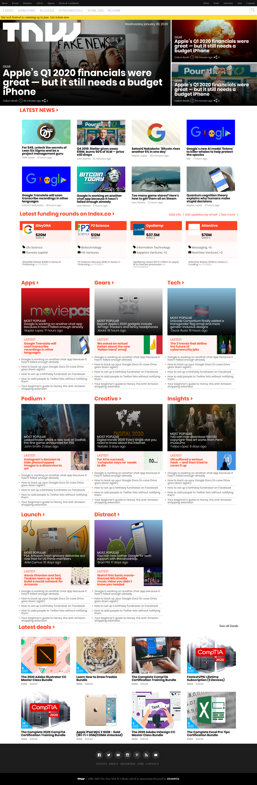

# HTML CSS Project 6

Web Page Clone of The Next Web, a tech-focused magazine which uses media queries to gracefully degrade their site as the window size is reduced.

# HTML Form

Sixth Microverse HTML and CSS Project

# What it does

It is the clone of https://thenextweb.com/ page

## Built With

- HTML5
- CSS3

#### and deployed to GitHub

## Live Demo

[Live Demo](https://rawcdn.githack.com/abdelp/building-with-responsive-design/45e365d0809ec246a33dd5e332d19ee4cee75ec6/index.html)

## Authors

**Abdel Pérez**
- Github: [@AbdelP](https://github.com/abdelp/)
- Twitter: [@AbdelPerez11](https://twitter.com/abdelperez11)
- Linkedin: [Abdel Pérez](https://www.linkedin.com/in/abdel-p%C3%A9rez-t%C3%A9llez-72b2aa153/)

**Oscar Russi**
- Github: [@andresporras3423](https://github.com/andresporras3423/)
- Linkedin: [Oscar Russi](https://www.linkedin.com/in/oscar-andr%C3%A9s-russi-porras-053236167/)

## 🤝 Contributing

This is a project for educational purposes only. We are not accepting contributions.

## Attributions and Credit

Special thanks to Microverse, for this learning opportunity. 

## Show your support

Give a ⭐️ if you like this project!

## Enjoy!
